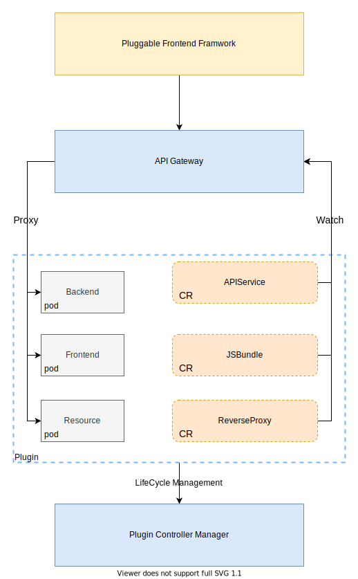

In KubeSphere LuBan, the mechanism for backend extensions includes API dynamic proxies, static proxies, and extension lifecycle management. The Core module of KubeSphere retains the following three major components:

* `ks-apiserver`: an extensible API gateway that provides KubeSphere with unified API authentication, proxy forwarding of requests, and API aggregation capabilities.
* `ks-controller-manager`: implements the logic for critical resource management.
* `ks-console`: provides a web UI for KubeSphere.

Built on top of Kubernetes, KubeSphere enables data storage, caching, and synchronization based on custom resources. For more information, see [Custom resources in Kubernetes](https://kubernetes.io/docs/concepts/extend-kubernetes/api-extension/custom-resources/).



## Principles

You can use the following custom resource definitions (CRDs) to register APIs, extend frontend functionalities, and configure dynamic agents.

### APIService

KubeSphere provides a declarative API registration mechanism similar to [Kubernetes API Aggregation Layer](https://kubernetes.io/docs/concepts/extend-kubernetes/api-extension/apiserver-aggregation/).

Sample code:

```yaml
apiVersion: extensions.kubesphere.io/v1alpha1
kind: APIService
metadata:
  name: v1alpha1.example.kubesphere.io
spec:
  group: example.kubesphere.io
  version: v1alpha1                                      
  url: https://example.kubesphere-system.svc  
# caBundle: <Base64Data>
# insecureSkipTLSVerify: false
# service:
#   namespace: kubesphere-system
#   name: example
#   port: 80
```


| Parameter                                               | Description                                                                                                                                                                                           |
| ------------------------------------------------------- | ----------------------------------------------------------------------------------------------------------------------------------------------------------------------------------------------------- |
| `spec.group`, `spec.version`                            | 创建 APIService 类型的 CR 会向 ks-apiserver 动态注册 API，其中`spec.group`、`spec.version`表示所注册的API路径中的 API Group 与 API Version，请参考 [API 概念](../../references/kubesphere-api/)                                       |
| `spec.url`、`spec.caBundle`、`spec.insecureSkipTLSVerify` | 可以为 APIService 指定外部服务，将 API 请求代理到指定的 endpoint，请参考 [Endpoint](https://github.com/kubesphere/kubesphere/blob/feature-pluggable/staging/src/kubesphere.io/api/extensions/v1alpha1/types.go#L49-L58)      |
| `spec.service`                                          | 与 `spec.url` 类似，可以为 API 指定 K8s 集群内部的服务引用地址，请参考 [ServiceReference](https://github.com/kubesphere/kubesphere/blob/feature-pluggable/staging/src/kubesphere.io/api/extensions/v1alpha1/types.go#L30-L47) |


### JSBundle

JSBundle 定义了需要注入到前端框架中的扩展包。`ks-console` 会自动加载此类资源，实现功能动态扩展。

示例与字段说明：

```yaml
apiVersion: extensions.kubesphere.io/v1alpha1
kind: JSBundle
metadata:
  name: v1alpha1.example.kubesphere.io
spec:
# filenameOverride: "index.js"
# raw: ""
  rawFrom:
    url: https://example.kubesphere-system.svc/dist/example.kubesphere.io/v1alpha1/index.js
  # caBundle: ""
  # configMapKeyRef:
  #   name: example
  #   key: index.js
  #   namespace: kubesphere-system
  # secretKeyRef:
  #   name: example
  #   key: index.js
  #   namespace: kubesphere-system
```

| 字段                                                                    | Description                                                  |
| --------------------------------------------------------------------- | ------------------------------------------------------------ |
| `spec.raw`、`spec.rawFrom.configMapKeyRef`、`spec.rawFrom.secretKeyRef` | 为了便于开发，体积较小的 js 文件可以直接在 CR 中进行定义或者直接嵌入到 ConfigMap 或 Secret 中 |
| `spec.rawFrom.url`                                                    | 体积较大的 js 文件则需要通过额外的后端服务来提供，扩展组件被启用之后，`ks-console` 会自动注入该扩展包  |


### ReverseProxy

提供灵活的 API 反向代理声明，支持 rewrite、redirect、请求头注入、熔断、限流等高级配置。

示例与字段说明：

```yaml
apiVersion: extensions.kubesphere.io/v1alpha1
kind: ReverseProxy
metadata:
  name: example.kubesphere.io
spec:
  matcher:
  - path: /res/example.kubesphere.io/images/*
    method: GET
  upstream:
    insecureSkipVerify: false
    caBudle: <Base64Data>
    url: https://example.kubesphere-system.svc
#   service:
#     namespace: kubesphere-system
#     name: example
#     port: 80
  directives:
    stripPathPrefix: '/res/example.kubesphere.io'
    headerUp:
    - '-Authorization'
    headerDown:
    - 'Content-Type image/jpeg'
```

| 字段                | Description            |
| ----------------- | ---------------------- |
| `spec.matcher`    | API 的匹配规则，可以用来拦截特定的请求  |
| `spec.upstream`   | 定义具体的服务后端，支持健康检查、TLS配置 |
| `spec.directives` | 可以向请求链注入不同的指令          |

#### Directives

1. `method` 修改 HTTP 请求方法

```yaml
spec:
  directives:
    method: 'POST'
```

2. `stripPathPrefix` 移除请求路径中的前缀

```yaml
spec:
  directives:
    stripPathPrefix: '/path/prefix'
```

3. `stripPathSuffix` 移除请求路径中的后缀

```yaml
spec:
  directives:
    stripPathSuffix: '.html'
```

4. `headerUp` 为发送到上游的请求增加、删除或替换请求头

```yaml
spec:
  directives:
    headerUp:
    - '-Authorization'
    - 'Foo bar'
```

5. `headerDown` 为上游返回的响应增加、删除或替换响应头

```yaml
spec:
  directives:
    headerDown:
    - 'Content-Type "application/json"'
```