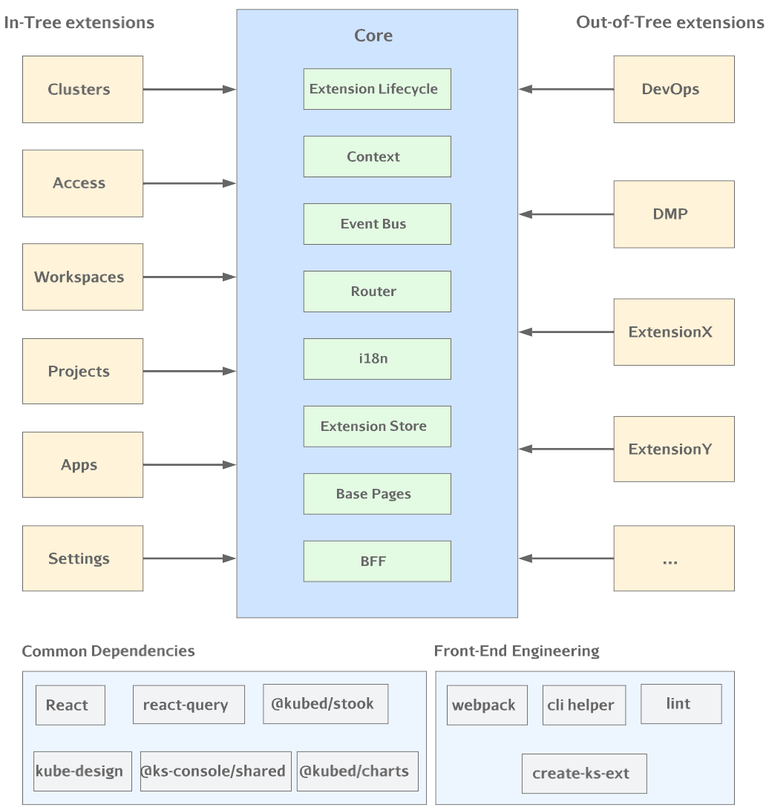

To enable flexibility and scalability, KubeSphere adopts an architecture that consists of a `microkernel and extension components`. In this architecture, the microkernel provides only the basic features for system running, and business modules are encapsulated separately in extension components. You can dynamically install, uninstall, start, or stop extension components during system running. The following figure shows the architecture:




## Principles

When it comes to decoupling megalithic applications and dynamic extensions, the buzzword `micro frontends` in recent years must pop into our mind. Well-known implementations of `micro frontends` such as qiankun and micro-app have done a lot of work on JavaScript sandboxes and styling isolation, so as to prevent the styles of sub-applications in a micro-frontend framework inadvertently affect the styles of other sub-applications. Styling isolation is often a compromise to solve specific technical debt or team coordination problems. If a front-end system integrates React, Vue, and Angular, it will be difficult to ensure UI consistency, and the size of the front-end bundle will also be significantly increased. Moreover, if each sub-application is isolated in its own runtime, and its integration with the main application is not tight enough.

To enable extensibility, KubeSphere LuBan 4.0 aims to implement `micro frontends` or `micro modules`, which are more lightweight and have less demand for styling isolation. In a `micro module` architecture, sub-applications can share the tech stack and runtime with the main application. This can achieve experience consistency, high integration, and easy dependency sharing, thereby improving operation efficiency. As shown in the preceding architecture, the development of extension components relies on common dependencies such as kube-design and @ks-console/shared. Then, extensions can be packaged and released by using CLI tools. In the Core module, you can sign up for and run extension components.

## Core components
The core components provide the following main features:
1. Extension management

   Two steps are important for extension management: load JavaScript bundles in the runtime and authorize and authenticate extensions. KubeSphere LuBan 4.0 uses SystemJS to load JavaScript bundles for extensions, 同时约定扩展组件的入口规范，从而使其可以连接到核心系统中运行。
2. 通讯机制

   内核中我们内置了EventBus(pub/sub), 可以方便的在内核和扩展组件之间、扩展组件与扩展组件之间进行通信。
3. 路由管理

   基于 react-router，扩展组件定义的路由会在扩展组件注册时统一到内核中进行管理。
4. 国际化

   基于 i18next 实现了国际化。开发者可以在扩展组件里按 i18next 的格式去定义翻译文件，然后按约定注册到内核中。
5. 扩展组件商店

   类似 chrome 浏览器的扩展程序，我们也有一个可视化的扩展组件管理模块，方便用户在页面上实现对扩展组件的安装、卸载、启动、停止等操作。

6. 基础页面

   系统运行起来的一些必备的 UI 元素，包括登录页面、页面 layout 等。
7. BFF

   基于 koa 实现的 BFF 层。主要负责首页渲染、请求转发、数据转换及一些轻量的后端任务。


## 扩展组件

如上面架构图，扩展组件分为`In-Tree 扩展组件`和`Out-of-Tree 扩展组件`。区别是：
* `In-Tree 扩展组件`基本上是系统必备或者常用的功能组件，它们会和`core`在编译时打包在一块。`In-Tree 扩展组件` 目前包括：
1. Cluster 集群管理
2. Access 访问控制
3. Workspaces 工作空间
4. Projects 项目管理
5. Apps 应用商店
6. Settings 平台设置

* `Out-of-Tree 扩展组件`是开发者在自己的代码仓库里开发的扩展组件，独立编译打包。它们会发布在`扩展组件商店`上。用户安装后，内核会远程加载扩展组件的 `js bundle` 并注册到内核中。

`Out-of-Tree 扩展组件`的前端部分统一使用 [create-ks-ext](https://github.com/kubesphere/create-ks-ext) 脚手架工具初始化。初始化后目录如下:

```bash
.
├── babel.config.js
├── configs
│   ├── config.yaml
│   ├── console.config.js
│   └── local_config.yaml
├── extensions
│   ├── entry.ts
│   └── hello-world
│       ├── Dockerfile
│       ├── README.md
│       ├── package.json
│       └── src
│           ├── App.jsx
│           ├── index.js
│           ├── locales
│           │   ├── en
│           │   │   ├── base.json
│           │   │   └── index.js
│           │   ├── index.js
│           │   └── zh
│           │       ├── base.json
│           │       └── index.js
│           └── routes
│               └── index.js
├── node_modules
├── package.json
├── tsconfig.base.json
├── tsconfig.json
└── yarn.lock
```

可以看出这和普通的 react app 基本一样。不同的点在于对 entry 的定义。示例如下：
```javascript
import routes from './routes';                   // 导入路由
import locales from './locales';                 // 导入国际化文件

const menu = {                                   // 定义菜单 
  parent: 'topbar',                              // 菜单父级
  name: 'hello-world',                           // 菜单 name 标识 
  link: '/hello-world',                          // 入口 url    
  title: 'Hello World',                          // 菜单名称  
  icon: 'cluster',                               // 菜单 icon
  order: 0,                                      // 菜单排序  
  desc: 'This is hello-world extension',         // 菜单描述
  skipAuth: true,                                // 是否忽略权限检查
};

const extensionConfig = {
  routes,
  menus: [menu],
  locales,
};

globals.context.registerExtension(extensionConfig);    // 通过全局对象注册扩展组件
```
如上，扩展组件使用脚手架初始化后，定义入口文件。业务代码开发模式和普通前端项目无异。开发完成后打包发布。扩展组件有自己独立的仓库，代码层面对内核部分没有任何侵入。

## 开发赋能
为方便开发者更高效的开发扩展组件，同时也为了系统体验一致性的约束及运行效率的考虑，我们提供了一些通用的组件、工具等库。
1. 通用组件库 [KubeDesign](https://github.com/kubesphere/kube-design)
2. 前端脚手架工具 [create-ks-ext](https://github.com/kubesphere/create-ks-ext)
3. 轻量的状态管理库 @ks-console/stook
4. 通用 util 库 @ks-console/shared
